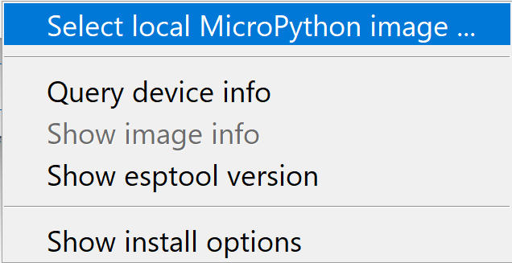

## Thonny Installation

We will use Thonny to interact with our ESP32 from our computer

1. Navigate to the Thonny website [here](https://thonny.org/)
2. Download the appropriate version for your OS
3. Run the installer, follow the prompts

## Micropython Installation

### Step 1

| Windows11                           | MacOS                               |
| ----------------------------------- | ----------------------------------- |
|          |  |

### Step 2

| Windows11                           | MacOS                               |
| ----------------------------------- | ----------------------------------- |
|  |  |

### Step 3

| Windows11                           | MacOS                               |
| ----------------------------------- | ----------------------------------- |
| |  |

### Step 4

| Windows11                           | MacOS                               |
| ----------------------------------- | ----------------------------------- |
| |  |

### Step 5

| Windows11                           | MacOS                               |
| ----------------------------------- | ----------------------------------- |
| |  |

### Step 6

| Windows11                           | MacOS                               |
| ----------------------------------- | ----------------------------------- |
| |  |

### Step 7

| Windows11                           | MacOS                               |
| ----------------------------------- | ----------------------------------- |
| |  |

