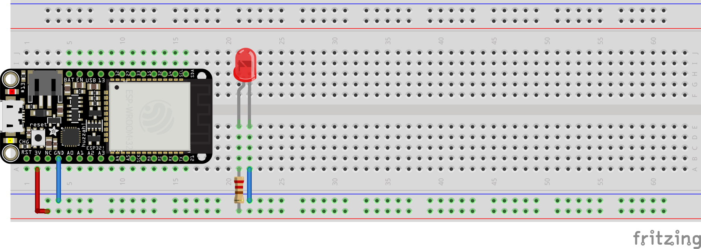
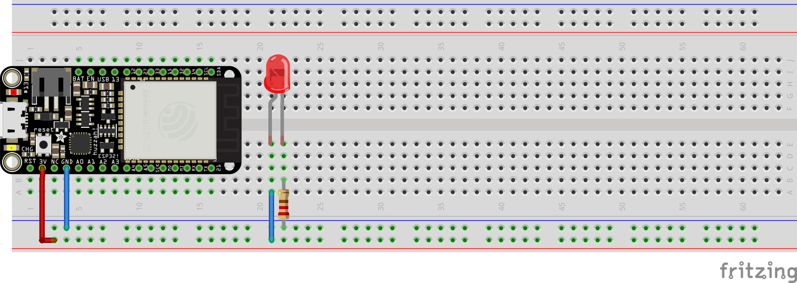
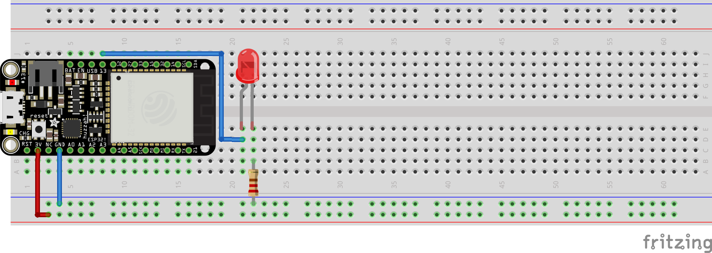

## basic LED circuit

There are two different ways to wire up a basic LED circuit to ESP32 `3V` and `GND`

### Hookup Pattern (1)



1. Connect ESP32 `GND` to a blue bus on the side of your breadboard
2. Connect ESP32 `3V` to a red bus on the side of your breadboard
3. Use a `220R` (or similar) to run the `3V` signal to the inside of your breadboard
4. Connect the longer of the two LED pins to `220R`, the shorter pin goes to and adjacent row
5. Connect the shorter LED pin to `GND` with a wire

### Hookup Pattern (2)



1. Connect ESP32 `GND` to a blue bus on the side of your breadboard
2. Connect ESP32 `3V` to a red bus on the side of your breadboard
3. Use a wire to run the `3V` signal to the inside of your breadboard
4. Connect the longer of the two LED pins to the wire, the shorter pin goes to and adjacent row
5. Connect the shorter LED pin to `GND` with a `220R`


## blink.py (internal LED)

There is a built-in (internal) LED on the ESP32 that is tied to pin 13, the code below will cause it to rhythmically blink

```python
'''
blink.py (internal led)
'''

from machine import Pin
from time import sleep

led = Pin(13, Pin.OUT)

while True:
    led.value(1)
    sleep(0.5)
    led.value(0)
    sleep(0.5)

```


## blink.py (external LED)

With some simple rewiring one can connect the external LED from above to pin 13 so it blinks in time with the built-in (internal) LED

### Hookup Pattern



1. Connect ESP32 `GND` to a blue bus on the side of your breadboard
2. Connect ESP32 `3V` to a red bus on the side of your breadboard
3. Connect a wire from ESP32 pin 13 to the longer of the two LED pins, the shorter pin goes to and adjacent row
4. Connect the shorter LED pin to `GND` with a `220R`
