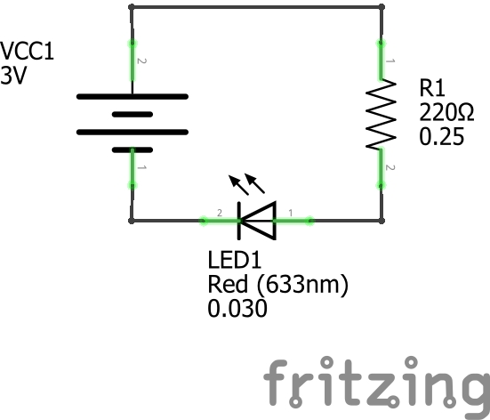
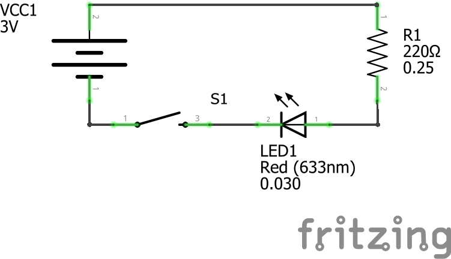
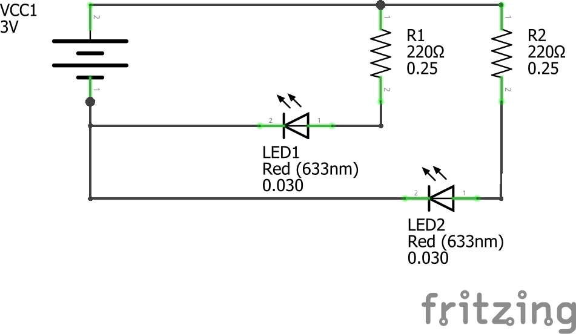
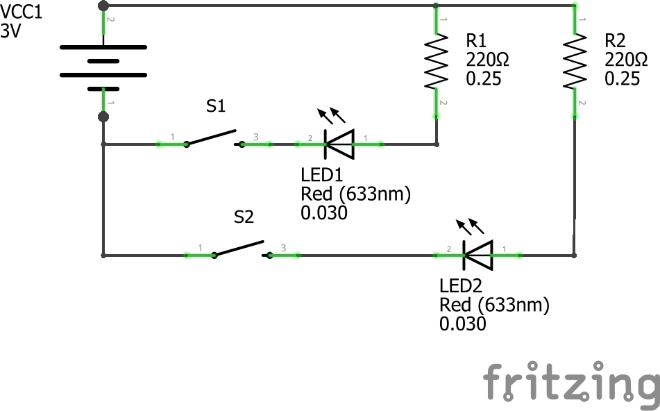

### button terminology

* State: on (connected, electrons can flow) or off (disconnected, electrons cannot flow)
* Acutation: the physical action necessary to change the state of a switch / button i.e. push, slide, flip, rotate
* Momentary: remain connected when actuated i.e. the push buttons are connected as long as we continue pushing them. When we release they return to their normal position (NO or NC)
* Toggle: stay in one state until actuated to a different state i.e. a light switch
* Pole: the number of circuits one switch can control simultaneously. We will use/make single pole switches
* Throws: the number of positions a switch can be thrown to. We will use/make single throw switches

Typically we refer to buttons by describing their method of actuation as well as quantity of poles and throws. For example: a Single Pole Single Throw Push-button

### button circuits

