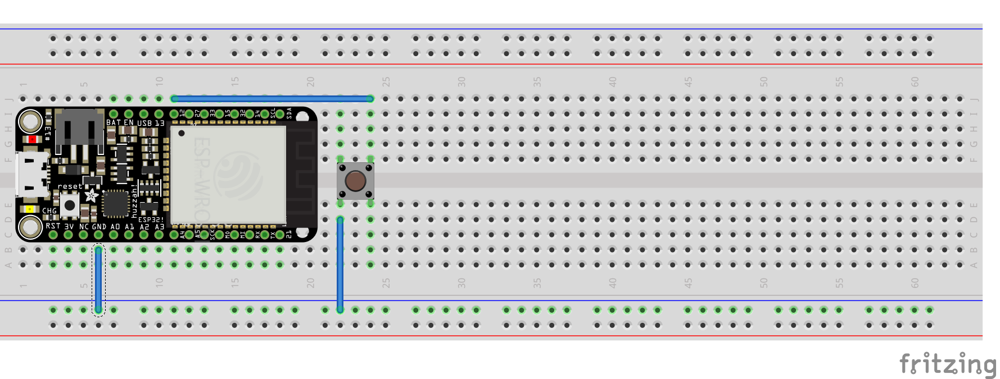
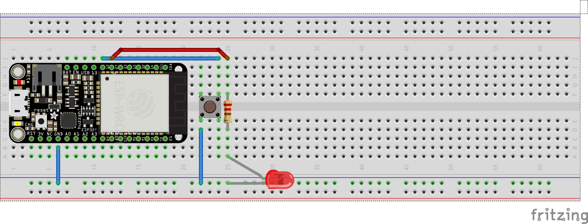

## Materials

* laptop
* internet access
* [Adafruit HUZZAH32](https://www.adafruit.com/product/3591)
* [USB cable - USB A to Micro-B - 3 foot long](https://www.adafruit.com/product/592) (or similar)
* 1x Breadboard
* 1x Resistor (220, 270, or 330 Ohms)
* 1x LED
* 1x SPST button


## Digital Input

### button.py

```python
'''
button.py
'''

from machine import Pin
from time import sleep_msx

button = Pin(12, Pin.IN, Pin.PULL_UP)

while True:
    if not button.value():
        print('Button pressed!')
    sleep_ms(20)

```

### Hookup Pattern



1. Connect 1 button pin to ESP32 Pin 12
2. Connect another button pin to ESP32 GND


## Digital Input / Digital Output

### button_led.py

```python
'''
buttonLed.py
'''

from machine import Pin
from time import sleep_ms

button = Pin(12, Pin.IN, Pin.PULL_UP)
led = Pin(27, Pin.OUT)

while True:
    if not button.value():
        led.value(1)
    else:
        led.value(0)
    sleep_ms(20)

```

### Hookup Pattern



1. Connect 1 button pin to ESP32 Pin `12`
2. Connect ESP32 `GND` to a blue bus on the side of your breadboard
3. Connect another button pin to the same blue bus on the side of your breadboard
4. From pin `27`, connect the following in series: a Resistor to an LED to GND (blue bus)
