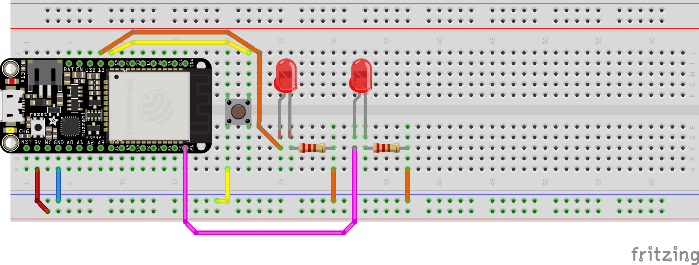

```python

'''
button_led.py

toggle between two LEDs via button press
'''

from machine import Pin
from time import sleep_ms

button = Pin(12, Pin.IN, Pin.PULL_UP)
led1 = Pin(27, Pin.OUT)
led2 = Pin(33, Pin.OUT)

while True:
    if not button.value():
        print("LED1 IS ON, LED2 IS OFF")
        led1.value(1)
        led2.value(0)
    else:
        print("LED1 IS OFF, LED2 IS ON")
        led1.value(0)
        led2.value(1)
    sleep_ms(20)

```
