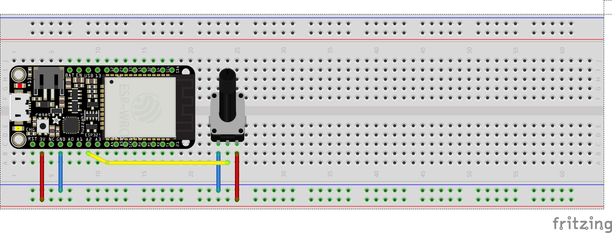

## analog_read.py

```python
# analog read

from machine import ADC, Pin
from time import sleep_ms

adc = ADC(Pin(34))
adc.atten(ADC.ATTN_11DB)

while True:
    print(adc.read())
    sleep_ms(20)
```

### Hookup Pattern



1. Connect Pot1 to ESP32 `GND`
2. Connect Pot2 to ESP32 `34`
3. Connect Pot3 to ESP32 `3V`

