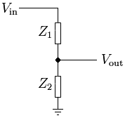
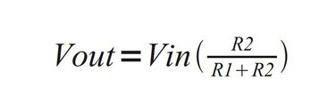
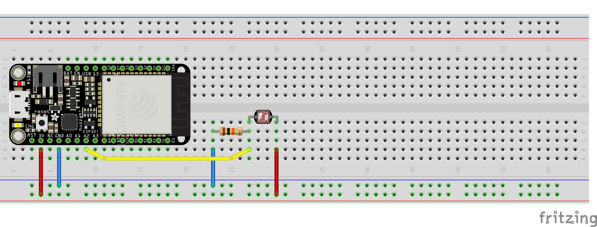

A voltage divider is a circuit that produces an output that is smaller than its input (where the output is voltage or current).

The above schematic represents the most basic way to use two resistors (labeled as `Z1` and `Z2`) to take some voltage (`Vin`) and output a fraction of it (`Vout`). The amount of `Vin` that is output at `Vout` depends on the values of the two resistors. This is the basic wiring pattern for almost any analog sensor, btw.

If you need to calculate the value of `R1` and `R2` (fyi: in this case, I am using `Z` and `R` interchangeably, but `Z` refers to impedance and `R` refers to resistance) such that you can get a specific `Vout`, here is the formula:

## Voltage Dividers = Sensors (Sometimes!)

### Hookup Pattern

1. Connect LDR Pin1 (`Z1` in Voltage Divider schematic above) to ESP32 `3V`
2. Connect LDR Pin2 to ESP32 `34`
3. Connect Resistor Pin2 (`Z2` in Voltage Divider schematic above) to ESP32 `GND`

There are a collection of voltage divider-based sensors that can be used interchangeably, from a hardware and software standpoint, for wildly different interactions. To name only a few:

* [Light-dependent resistor](https://www.adafruit.com/product/161)
* Force-sensitive resistor, available in a [variety](https://www.adafruit.com/product/1075) of [shapes](https://www.adafruit.com/product/166).
* [Flex Sensor](https://www.adafruit.com/product/1070)

