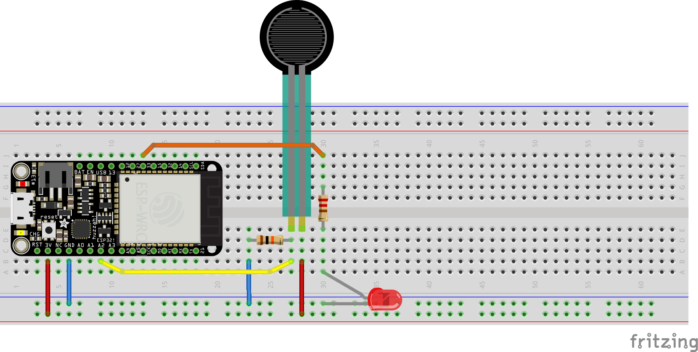

## analogIn_PWMOut.py

### Hookup Pattern



1. Connect Sensor Pin3 to `ESP32` `3V`
2. Connect Sensor Pin2 to `ESP32` `34`
3. Connect Resistor Pin2 to `ESP32` `GND`
4. From pin 27, connect the following in series: a Resistor to an `LED` to `GND`

Follow along on your `ESP32`

*For Example*
```python
# analog in to pwm out

from machine import ADC, Pin, PWM
from time import sleep_ms

ledPin = Pin(33)
potPin = Pin(34)

pot = ADC(potPin)
pot.atten(ADC.ATTN_11DB)
pot.width(ADC.WIDTH_10BIT) # 0 - 1023

pwm = PWM(ledPin, freq=20000, duty=0)

while True:
    sensor_val = pot.read()
    print(sensor_val)
    pwm.duty(sensor_val)
    sleep_ms(20)


```

* note that the analog input, here stored at `sensor_value`, is passed to `pwm.duty()`. This allows the sensor value to control the brightness of the `LED`.

## threshold.py

```python
'''
threshold.py
'''

from machine import ADC, Pin
from time import sleep_ms

potPin = Pin(34, Pin.IN)
led = Pin(27, Pin.OUT)

pot = ADC(potPin)
pot.atten(ADC.ATTN_11DB)
pot.width(ADC.WIDTH_10BIT) # 0 - 1023

while True:
    sensor_val = pot.read()
    if sensor_val >= 512:
        print("crossed threshold!")
        led.value(1)
    else:
        led.value(0)
    sleep_ms(20)

```

* above we use a `boolean` test to see if the `sensor_val` is currently  greater than or equal to (`>=`) `512` (50% of ADC value on pin `34`). If this test returns `True` the `LED` will turn on, otherwise it will turn off.
