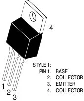
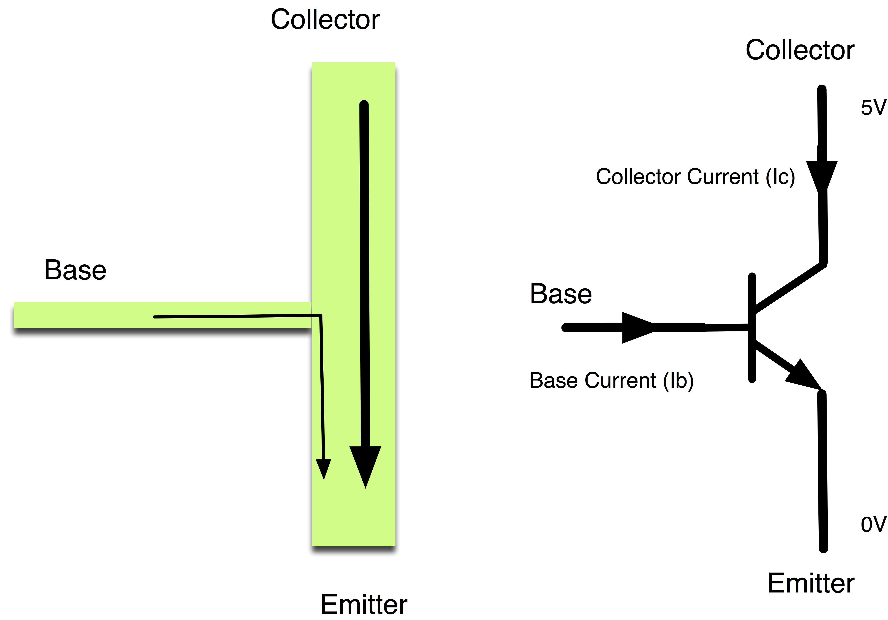
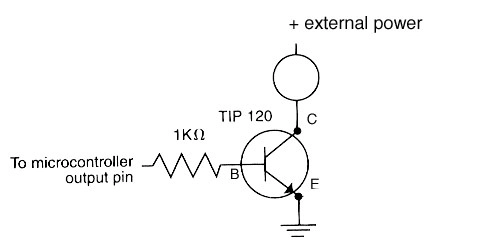
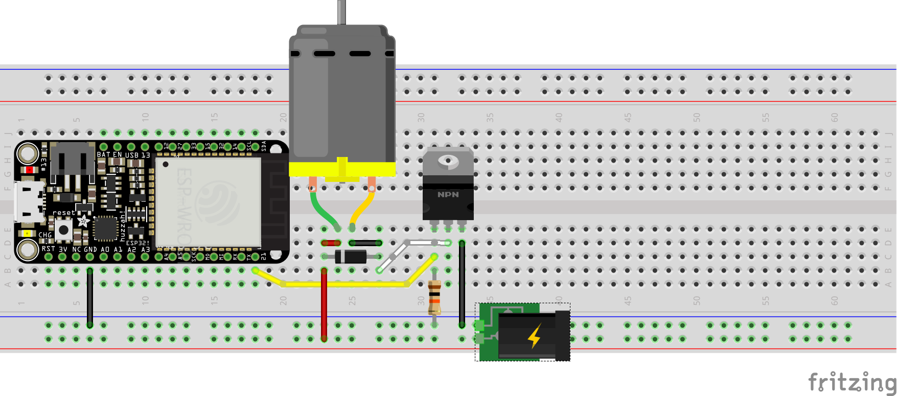
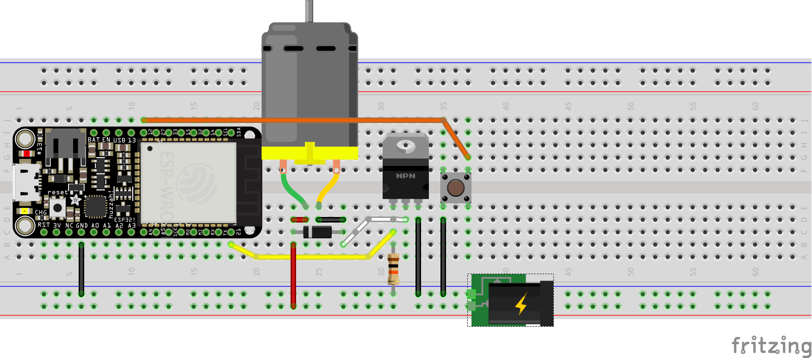

## Transistors

*Note: props to [this](http://bildr.org/2011/03/high-power-control-with-arduino-and-tip120/) fantastic article*

Transistors are three pin components capable of amplifying or switching signals. In Physical Computing we typically use them to control high voltage devices (like motors, lights, or solenoids) by quickly toggling a pin between `HIGH` and `LOW` (i.e. `PWM`).

While there are a variety of different types of transistors, we will focus on the `TIP120`, a pinout for which can be found below:



1. Base -> Control
2. Collector -> Input
3. Emitter -> Output

More specifically, transistors are based on the following phenomena: a small current flowing between the base (`B`) and emitter (`E`) causes a larger current to flow between the collector (`C`) and emitter (`E`).



## ESP32 + TIP120

### Schematic



### Hookup Pattern



After wiring up a `TIP120`, `diode`, `resistor`, and `motor` (as shown above), one could test controlling the motor with the following:

1. import `Pin` and `PWM` from `machine`: `from machine import Pin, PWM`
2. create a `PWM` object and store it at `pwm21`: `pwm21 = PWM(Pin(21), freq=20000, duty=0)`
3. set the `duty cycle` to 50%: `pwm21.duty(512)`
4. set the `duty cycle` to 100%: `pwm21.duty(1023)`
5. stop the motor: `pwm21.duty(0)`
6. turn off `PWM` mode on pin: `pwm21.deinit()`
7. `Ctl-A` `Ctl-\` to exit


## TIP120 as Digital Switch

When the `ESP32` sends a `HIGH` signal to the `TIP120` `Base` the transistor switches, connecting the `Collector` and `Emitter` pins. If `C` and `E` are connected the circuit is `closed` (or `complete`), allowing current to travel to the motor which causes it to spin.

When the `ESP32` sends a `LOW` signal to the `TIP120` `Base` the transistor disconnects the `Collector` and `Emitter`. This results in an `open` (or `incomplete`) circuit and the motor stops spinning.

The speed (rate of rotation) of the motor is controlled by how long the `PWM` pin is `HIGH` compared to the length of a single period (`LOW` plus `HIGH` time), otherwise known as the `duty cycle`.

Note: the exact same wiring pattern used to control a motor (see schematic above) can be used to control a large light or solenoid, one simply needs to remove the motor and replace with one of the other actuators. Certain solenoids will require changes to software to reflect their physical properties.

### Hookup Pattern



In the next example a button, added to pin `12`, controls whether the motor spins or not.

*For Example*
```python
# digital in to pwm out

from machine import ADC, Pin, PWM
from time import sleep_ms

motorPin = Pin(21)
pwm = PWM(motorPin, freq=20000, duty=0)

button = Pin(12, Pin.IN, Pin.PULL_UP)

while True:
    if not button.value():
        print("Spin")
        pwm.duty(1023)
    else:
        print("Stop")
        pwm.duty(0)
    sleep_ms(20)
```

